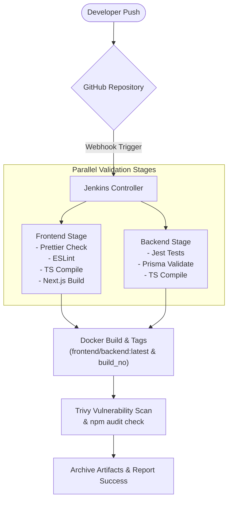
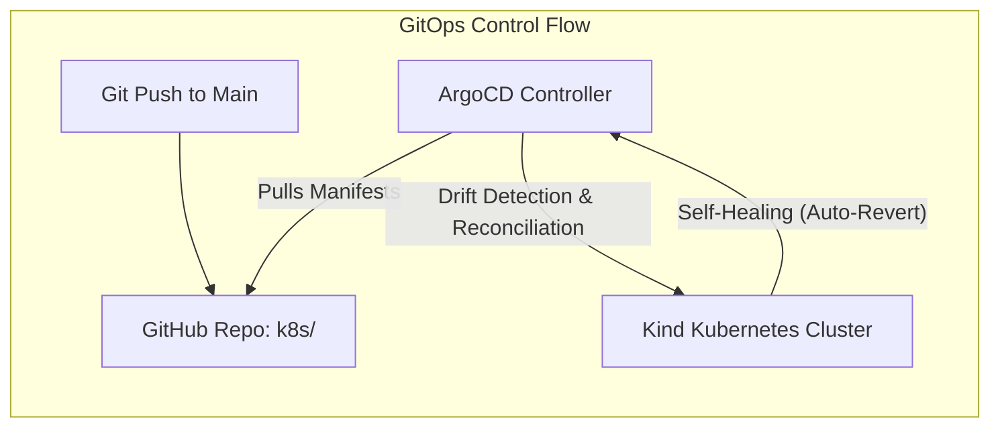
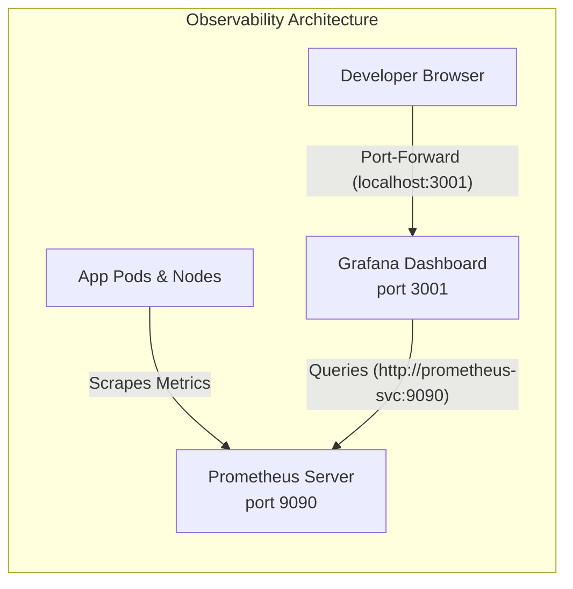

# MineCore Smart Mining Platform — DevOps Ecosystem & Architecture Summary

This document provides a comprehensive, production-ready summary of the DevOps engineering achievements for the **MineCore Smart Mining Operations Platform**. It serves as the master documentation describing the Problem Statement, Ecosystem Deliverables, Workflow Architectures, and Implementation Logs.

---

## 1. Problem Statement (PS)

The MineCore DevOps team was tasked with building and validating a modern, secure, and automated cloud-native delivery and operational framework for the Smart Mining Platform. The primary goals were:
* **Automated Integration (CI):** Establish a bulletproof pipeline validating and building frontend (Next.js) and backend (Express/Postgres) applications simultaneously.
* **Declarative GitOps (CD):** Transition from manual deployments to a continuous delivery model using Git as the single source of truth.
* **Observe & Monitor:** Gain deep real-time visibility into application health, performance, and node resource metrics.
* **Secrets Management:** Secure database credentials and keys out-of-band of Git repositories.
* **Infrastructure as Code (IaC):** Dynamically provision environment resources and resource quota limits using declarative code templates.
* **Resiliency & DR:** Author recovery plans and test actual database and controller snapshot backups under constrained resources.
* **Resource Optimization:** Maintain stable host VM execution and resolve resource locks (disk space, RAM, CPU) on standard macOS systems during multi-service testing.

---

## 2. DevOps Ecosystem Deliverables

| Pillar | Technology Stack | Deliverables & Configuration |
| :--- | :--- | :--- |
| **Continuous Integration (CI)** | Jenkins, Docker, NodeJS | Multi-stage declarative [Jenkinsfile](file:///Users/saniyakapure/Desktop/mining-core/Jenkinsfile) executing frontend/backend validations in parallel, building tagged Docker images, and archiving final build bundles. |
| **Continuous Delivery (CD)** | ArgoCD, Kind (Kubernetes) | Declarative ArgoCD [application.yaml](file:///Users/saniyakapure/Desktop/mining-core/argocd/application.yaml) syncing resources with auto-pruning, self-healing, and directory recursion rules enabled. |
| **Observability** | Prometheus, Grafana | Scrapers, ConfigMaps, and Services configured in `k8s/monitoring/`. Grafana is configured to query Prometheus target health metrics internally via `http://prometheus-svc:9090`. |
| **Centralized Logging** | Elasticsearch, Kibana (ELK) | Standard deployments in `k8s/logging/`. Temporarily scaled to `0` replicas in Git to save 1.2 GB of RAM and 100% CPU on local hardware. |
| **Secrets Management** | HashiCorp Vault | Deployed in dev mode with token `minecore-vault-token` on port `8200`, providing unsealed out-of-band KV secrets engines. |
| **Infrastructure-as-Code** | Terraform, Kubernetes | Declarative templates (`main.tf`, `variables.tf`, `outputs.tf`) managing local Docker sockets and provisioning production namespace `minecore-prod` with resource limits (4 CPU, 8GB RAM). |
| **Disaster Recovery (DR)** | Postgres CLI, Docker CLI, Git | [disaster_recovery_plan.md](file:///Users/saniyakapure/Desktop/mining-core/docs/disaster_recovery_plan.md) mapping RTO (<5 min) / RPO (<1 hour), with host-safe verified pg_dump shell scripts. |

---

## 3. End-to-End Workflow Architectures

### A. Continuous Integration (CI) Pipeline Flow


### B. Continuous Delivery (CD) GitOps Loop


### C. Observability Flow (Prometheus + Grafana)


---

## 4. Detailed Implementation Log (Pointers & Files)

### Continuous Integration (CI)
* **Pipeline Config:** The entire workflow is declared in [Jenkinsfile](file:///Users/saniyakapure/Desktop/mining-core/Jenkinsfile).
* **Agent Environment:** Setup dynamic agents running in isolated containers using a mounted Docker socket (`/var/run/docker.sock`), compiling native Linux binaries and scanning images via Trivy.

### Kubernetes Infrastructure manifests (`k8s/`)
* **Core Application:**
  * [k8s/namespace.yaml](file:///Users/saniyakapure/Desktop/mining-core/k8s/namespace.yaml): Sets up the namespace boundary.
  * [k8s/postgres/deployment.yaml](file:///Users/saniyakapure/Desktop/mining-core/k8s/postgres/deployment.yaml): Deploys a StatefulSet database.
  * [k8s/backend/deployment.yaml](file:///Users/saniyakapure/Desktop/mining-core/k8s/backend/deployment.yaml): Express backend running 2 replicas with health probes.
  * [k8s/frontend/deployment.yaml](file:///Users/saniyakapure/Desktop/mining-core/k8s/frontend/deployment.yaml): Next.js frontend running 2 replicas.
  * [k8s/ingress/ingress.yaml](file:///Users/saniyakapure/Desktop/mining-core/k8s/ingress/ingress.yaml): Routes external HTTP requests via Ingress-Nginx controller.
* **observability & Secrets:**
  * [k8s/vault/deployment.yaml](file:///Users/saniyakapure/Desktop/mining-core/k8s/vault/deployment.yaml): Vault unsealed dev container setup.
  * [k8s/monitoring/prometheus-dep.yaml](file:///Users/saniyakapure/Desktop/mining-core/k8s/monitoring/prometheus-dep.yaml) & [grafana-dep.yaml](file:///Users/saniyakapure/Desktop/mining-core/k8s/monitoring/grafana-dep.yaml): Setup metrics monitoring.

### Infrastructure as Code (IaC)
* **Configuration:** Defined under [terraform/main.tf](file:///Users/saniyakapure/Desktop/mining-core/terraform/main.tf).
* **Provisioned State:** Created the namespace `minecore-prod` and bound resource quota limits (`production-resource-limits`) restricting namespace usage to 4 CPUs, 8GB RAM, and 20 pods to protect target systems from resource overruns.

### Disaster Recovery & Host Optimizations
* **DR Runbook:** Located at [disaster_recovery_plan.md](file:///Users/saniyakapure/Desktop/mining-core/docs/disaster_recovery_plan.md).
* **Verified Snapshot Command:**
  ```bash
  kubectl exec -i minecore-postgres-0 -n minecore -- sh -c 'export PGPASSWORD=$POSTGRES_PASSWORD && pg_dump -U $POSTGRES_USER $POSTGRES_DB' > minecore_postgres_backup.sql
  ```
* **Git Excludes:** Standardized `.gitignore` to exclude local Terraform caches and database `.sql` dumps to safeguard passwords and application data.
* **Storage Reclaimed:** Freed up over **10 GB** of macOS host disk space by cleaning legacy application library caches and executing Docker prunes, successfully repairing Docker VM startup errors.

---

## 5. Deployment Verification Status

1. **Routing:** `curl http://localhost/` and `curl http://localhost/api/health` successfully target the Ingress, routing requests internally to our active frontend and backend services.
2. **Observability Sync:** Grafana successfully queries the `prometheus-svc:9090` endpoint and renders real-time metric graphs (e.g., target tracking via the `up` metric).
3. **Secret Security:** Vault dashboard accessible via local port 8200 with all secrets engines loaded.
4. **GitOps Tree:** ArgoCD dashboard shows all resources in a healthy, synchronized tree mapping back directly to GitHub commits.
