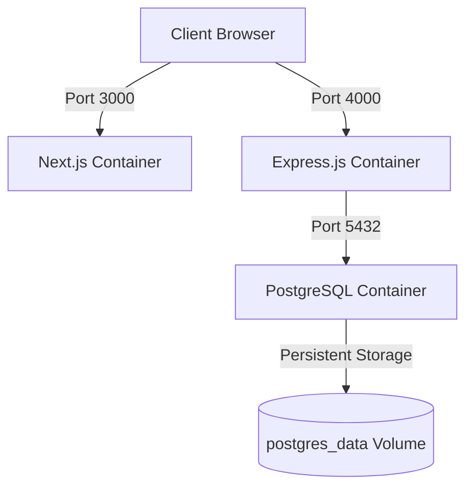

# MineCore Container Architecture & Orchestration

This document details the Docker configuration, image optimization strategies, networking, and volumes layout used for containerizing the full-stack MineCore application.

---

## 1. Container Topology

The application stack consists of three services running on a dedicated bridge network:

---

## 2. Dockerfile Build Processes & Optimizations

We use **multi-stage builds** and **Node 20 Alpine base images** to keep production images secure, lightweight, and fast to download.

### A. Next.js Frontend (`frontend/Dockerfile`)
Optimized using Next.js **standalone output mode** (configured in `next.config.ts`), which analyzes the dependency graph and exports only the files needed for production deployment.
- **Stage 1 (deps)**: Installs all Node modules.
- **Stage 2 (builder)**: Prepares the environment variables and runs `next build`.
- **Stage 3 (runner)**: Copies only `.next/standalone`, `.next/static`, and `public` folders.
- **Result**: Image size is reduced from **~1GB** down to **~150MB**.

### B. Express.js Backend (`backend/Dockerfile`)
Compiles TypeScript to production JavaScript and resolves path aliases compile-time using `tsc-alias`.
- **Stage 1 (builder)**: Installs all dependencies, generates the Prisma client binaries, and runs `tsc && tsc-alias` to compile TS source code.
- **Stage 2 (runner)**: Installs **only production dependencies** (`npm ci --only=production`), copies the built `/dist` directory, and carries over the generated Prisma client.
- **Prisma Alpine Fix**: Installs `openssl` and `libc6-compat` via `apk` to support Prisma's binary schema and migration engines in Alpine.

---

## 3. Environment Variables

The services consume the following environment configurations:

| Service | Variable | Purpose |
|---|---|---|
| **postgres** | `POSTGRES_USER` | DB owner username |
| | `POSTGRES_PASSWORD` | DB owner password |
| | `POSTGRES_DB` | Initial database name |
| **backend** | `DATABASE_URL` | Prisma DB connection string |
| | `JWT_ACCESS_SECRET` | Secret key for access token signing |
| | `CORS_ORIGIN` | Allowed web origin (`http://localhost:3000`) |
| **frontend** | `NEXT_PUBLIC_API_URL` | Backend endpoint URL exposed to the client |

---

## 4. Docker Compose Settings

The root [docker-compose.yml](file:///Users/saniyakapure/Desktop/mining-core/docker-compose.yml) orchestrates the services:

- **Networking**: All containers join `minecore-network` (bridge). They resolve each other using Docker's internal DNS (e.g. backend connects to database using `postgres:5432`).
- **Startup Order**: 
  - `backend` depends on `postgres`. On startup, it runs database migrations (`npx prisma migrate deploy`) before starting the Express server.
  - `frontend` depends on `backend`.
- **Persistence**: The PostgreSQL database data is mapped to a named volume `postgres_data` (`/var/lib/postgresql/data`) to prevent data loss when containers are stopped or deleted.
