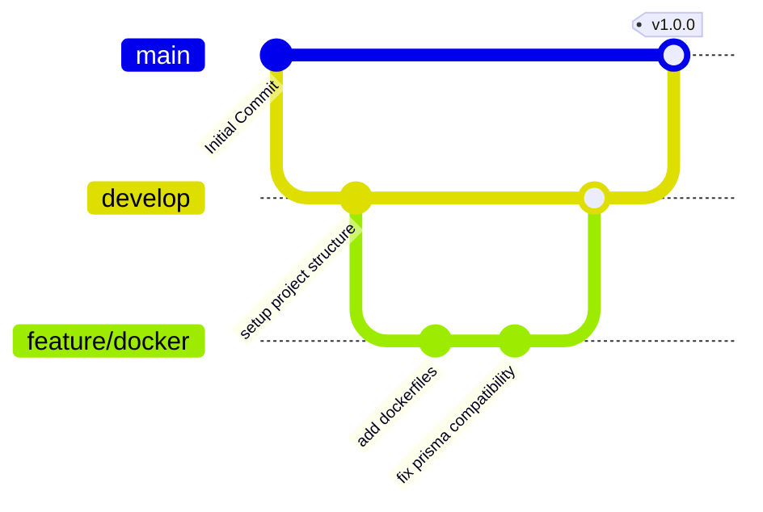

# MineCore Git Branching & Versioning Strategy

This document outlines the version control practices, branch workflows, and commit conventions used in the MineCore repository.

---

## 1. Branching Workflow (GitFlow Simplified)

We use a simplified version of GitFlow to maintain a clear history of stable production releases and active development features.



### Core Branches
- **`main`**: Represents production-ready code. Commits on `main` are strictly stable releases and are tagged with version numbers. Direct commits to `main` are prohibited.
- **`develop`**: The primary integration branch. This is where features are combined and tested before shipping to production. 

### Supporting Branches
- **`feature/*`**: Used for developing new features or enhancements (e.g., `feature/ci-pipeline`, `feature/alert-visuals`).
  - Branched off: `develop`
  - Merged back into: `develop` via Pull Request (PR)

---

## 2. Commit Conventions (Conventional Commits)

We enforce the [Conventional Commits](https://www.conventionalcommits.org/) specification to keep the Git history structured and automated changelogs clean.

### Commit Format
```text
<type>(<scope>): <description>
```

### Types
- **`feat`**: A new feature (e.g., `feat(frontend): add vehicle utilization charts`)
- **`fix`**: A bug fix (e.g., `fix(backend): install openssl in alpine container`)
- **`docs`**: Documentation changes only (e.g., `docs: add git branching guidelines`)
- **`style`**: Changes that do not affect the meaning of the code (formatting, missing semi-colons, etc.)
- **`refactor`**: A code change that neither fixes a bug nor adds a feature
- **`test`**: Adding missing tests or correcting existing tests
- **`chore`**: Changes to the build process, auxiliary tools, or libraries (e.g., dependency updates)

---

## 3. Release Strategy

1. **Feature Completion**: Once a feature is completed in `feature/*`, a Pull Request is submitted to merge into `develop`.
2. **Release Preparation**: When the `develop` branch is stable and ready for a release:
   - Create a Pull Request from `develop` into `main`.
   - Perform integration tests.
3. **Publishing the Release**:
   - Merge `develop` into `main`.
   - Tag the merge commit on `main` with semantic versioning:
     ```bash
     git checkout main
     git pull origin main
     git tag -a v1.0.0 -m "Release version 1.0.0"
     git push origin v1.0.0
     ```
